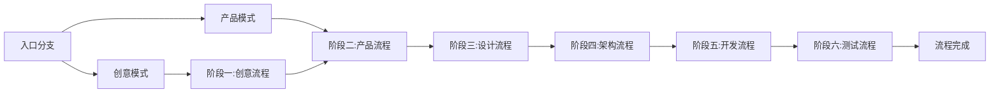

# SuperFlow — 超级生产线

全链路自主开发流程框架,通过多 Agent 协作实现从创意到代码的自动化生产。

## 是什么

SuperFlow 是一个基于 Claude Code 的开发框架,将软件开发拆解为 6 个标准化阶段,由 12 个专业 Agent 分工协作完成:

```
创意 → 产品 → 设计 → 架构 → 开发 → 测试
```

每个阶段都有对应的评审机制,确保质量可控、流程可追溯。

## 核心特点

### 双模式入口

| 模式 | 适用场景 |
|------|---------|
| **创意模式** | 无明确规划、探索性需求、需要创新方案 |
| **产品模式** | 需求明确、有参考实现、渐进式功能 |

### 六阶段流程

1. **创意流程**(仅创意模式):创意Agent 生成Creative Brief → 主控主动发起创意评审(创新性+可行性+商业价值)
2. **产品流程**:产品Agent 生成SPEC文档 → 主控主动发起SPEC评审
3. **设计流程**:设计Agent 设计UX/UI → 主控主动发起设计评审(可用性+一致性+可访问性)
4. **架构流程**:架构Agent 输出实现计划 → 主控主动发起计划评审
5. **开发流程**:开发Agent 编写代码 → 主控主动发起实现评审(完整性+代码质量+设计规范)
6. **测试流程**:测试Agent 编写测试用例/代码 → 执行测试 → 主控主动发起测试评审 → 生成测试报告

### 评审循环流转机制

- 每个阶段都有对应的评审 Agent
- 评审不通过时循环修复,最多 5 次
- 5 次后仍不通过,主控做出决断强制推进

### 主控协调

主控作为流程协调者,负责启动各阶段 Agent、转发信息、追踪进度,在必要时做出决断。

## 快速开始

###启动流程

在 Claude Code 中输入:

```bash
/superflow [你的需求描述]
```

### 示例

```bash
# 创意模式 - 让 AI 自由发挥
/superflow

# 产品模式 - 需求明确
/superflow 做一个待办事项应用,支持分类、优先级、提醒功能,使用 React + TypeScript

# 模糊需求 - 会询问模式
/superflow 做一个游戏
```

## 产出物

所有文档统一存放在 `docs/superflow/` 目录下:

```
docs/superflow/
├── creatives/              # 创意文档(仅创意模式)
│   └── YYYY-MM-DD-feature-name-creative.md
├── specs/                  # 产品规格文档
│   └── YYYY-MM-DD-feature-name-spec.md
├── plans/                  # 实现计划
│   └── YYYY-MM-DD-feature-name-plan.md
├── designs/                # UX/UI 设计文档
│   └── YYYY-MM-DD-feature-name-design.md
├── tests/                  # 测试相关
│   ├── YYYY-MM-DD-feature-name-unit-tests.md       # 单元测试用例
│   ├── YYYY-MM-DD-feature-name-platform-tests.md   # 平台测试用例
│   ├── YYYY-MM-DD-feature-name-acceptance-tests.md # 验收测试用例
│   └── YYYY-MM-DD-feature-name-test-report.md      # 测试报告
```

**feature-name 命名**:所有文档使用同一个 feature-name,由对应模式的 Agent 自动决定。

## 项目结构

```
super-flow/
├── .claude-plugin/
│   └── plugin.json           # Claude Code 插件配置
├── skills/
│   └── super-flow/
│       └── SKILL.md          # 主工作流定义(核心规则)
├── agents/                   # 12 个专业 Agent 定义
│   ├── creative-agent.md            # 创意Agent
│   ├── creative-reviewer.md         # 创意评审团
│   ├── product-agent.md             # 产品Agent
│   ├── spec-reviewer.md             # SPEC评审Agent
│   ├── architecture-agent.md        # 架构Agent
│   ├── plan-reviewer.md             # 计划评审Agent
│   ├── design-agent.md              # 设计Agent
│   ├── design-reviewer.md           # 设计评审Agent
│   ├── developer-agent.md           # 开发Agent
│   ├── implementation-reviewer.md   # 实现评审团
│   ├── tester-agent.md              # 测试Agent
│   └── test-reviewer.md             # 测试评审Agent
├── docs/
│   └── superflow/            # 产出文档存放目录
├── CLAUDE.md                 # Claude Code 记忆文件
└── README.md                 # 本文件
```

## 工作流程



## 深入了解

详细的流程规则、评审循环逻辑等,请查看 [SKILL.md](skills/super-flow/SKILL.md)。

## 许可证

本项目遵循原仓库的许可证协议。
